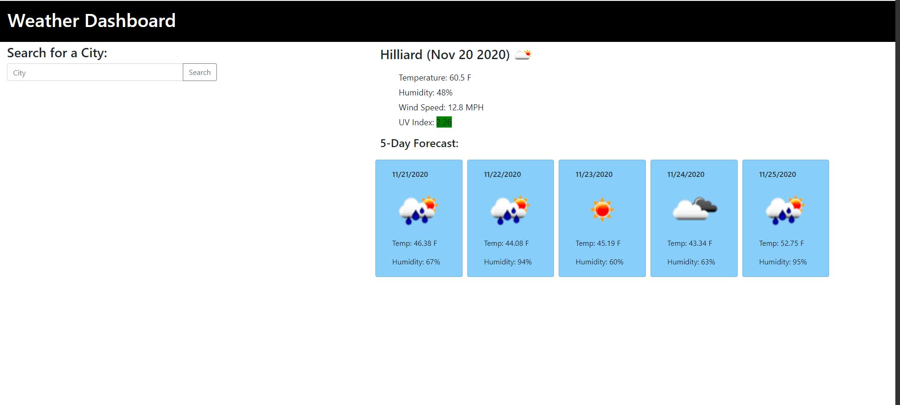
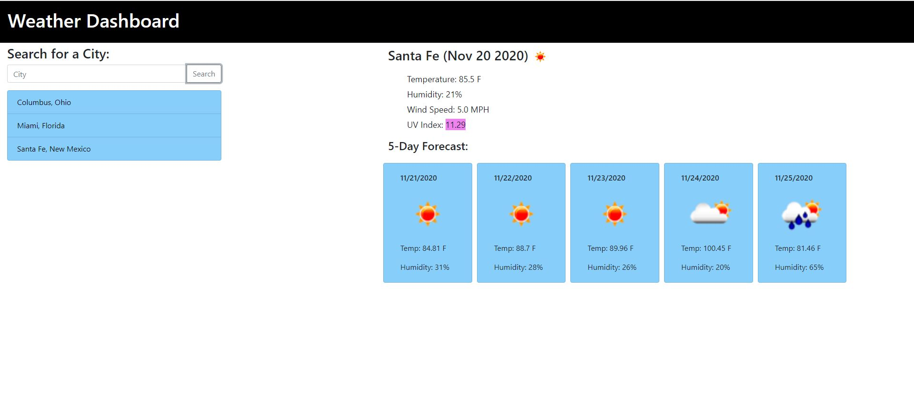

# WeatherDashboard

## Description:
This is an HTML application that allows the user to search for the weather in a chosen city. The is accomplished using the Open Weather API. The 5 day forecast and current date are also returned when a city is searched. All of the searched cities in a given session are stored in a list on the right side of the application. On page load the last called city is returned to the screen through local storage.

## Technologies Used:
* Bootstrap
* jQuery
* OpenWeather API

## Screen Shots:

## Links:
Repository: https://github.com/sziccardi1998/WeatherDashboard

Hosted Application: https://sziccardi1998.github.io/WeatherDashboard/